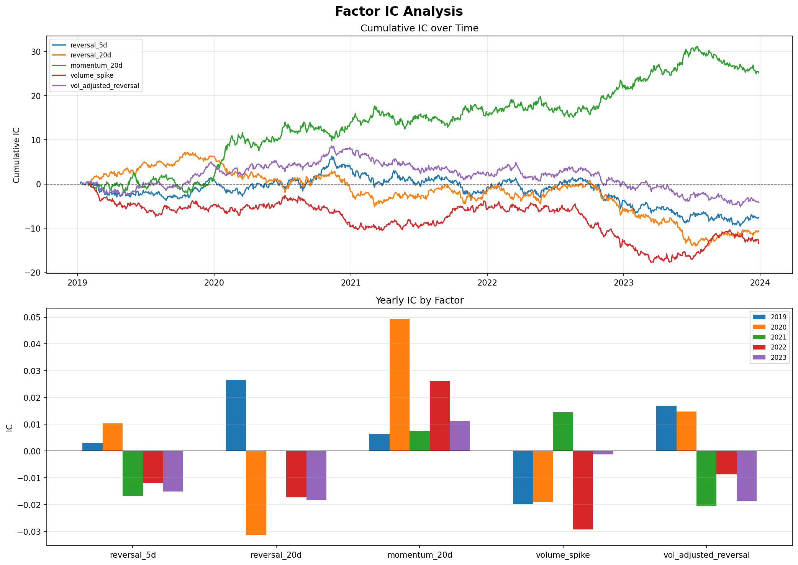
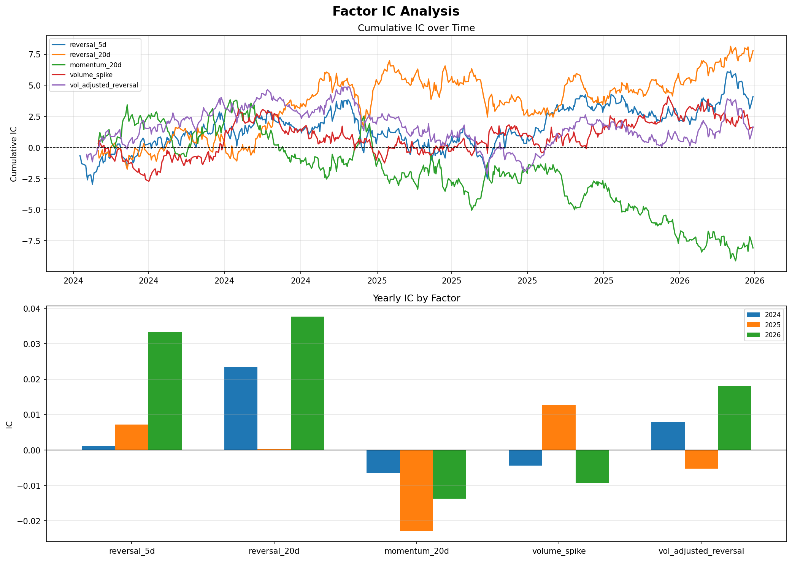

# Alpha Research: LLM-Driven Quantitative Factor Mining

A quantitative factor research framework combining traditional backtesting with LLM-driven factor generation. Inspired by [CogAlpha (Liu et al., 2025)](https://arxiv.org/abs/2511.18850).

---

## Key Finding

> **Market regime drives factor effectiveness.**
> Momentum factors dominated in trending markets (2019–2023), while reversal factors recovered strongly after Trump's tariff-driven volatility in 2025–2026. The LLM-generated factors independently confirmed this pattern — the best factor's IC improved from 0.0035 (2024) to 0.0225 (2025).

---

## Results

### Factor Performance Summary: 2019–2023

| Factor | IC | RankIC | ICIR | RankICIR | IC>0 |
|--------|----|--------|------|----------|------|
| reversal_5d | — | — | — | — | — |
| reversal_20d | — | — | — | — | — |
| momentum_20d | — | — | — | — | — |
| volume_spike | — | — | — | — | — |
| vol_adjusted_reversal | — | — | — | — | — |

> Replace `—` with your actual backtest output numbers.

### Factor Performance Summary: 2024–2026

| Factor | IC | RankIC | ICIR | RankICIR | IC>0 |
|--------|----|--------|------|----------|------|
| reversal_5d | — | — | — | — | — |
| reversal_20d | — | — | — | — | — |
| momentum_20d | — | — | — | — | — |
| volume_spike | — | — | — | — | — |
| vol_adjusted_reversal | — | — | — | — | — |

> Replace `—` with your actual backtest output numbers.

**2019–2023: Momentum dominates**



- `momentum_20d` cumulative IC reached 25+, far outperforming all other factors
- Reversal factors near zero — consistent with the 2021 bull market suppressing mean-reversion signals
- RankIC trends closely mirror IC, confirming results are not driven by outliers

**2024–2026: Regime shift after Liberation Day**



- `reversal_20d` IC surged to **0.037** in 2026 (highest across all periods)
- `momentum_20d` IC turned **negative** — trend-following broke down under policy uncertainty
- RankIC confirms the same pattern, ruling out extreme return distortion as the cause
- Pattern aligns with S&P 500 dropping ~10% in April 2025, then rallying sharply after tariff pause

### LLM Factor Search Results

3 rounds × 3 factors = 9 candidates generated and backtested automatically.

| Rank | Factor | IC | ICIR | Round |
|------|--------|----|------|-------|
| 1 | volume_surge_price_recovery_signal | +0.0136 | +0.0375 | R3 |
| 2 | volume_price_divergence_reversal | +0.0128 | +0.0360 | R2 |
| 3 | price_momentum_volume_confirmation | -0.0093 | -0.0311 | R2 |

**Best Factor:**
```
((close / close.rolling(10).mean() - 1) * -1) * (volume / volume.rolling(20).mean()).rolling(3).mean().rank(axis=1, pct=True)
```
Logic: Stocks with larger deviation below 10-day MA (oversold) AND sustained volume increase over 3 days → higher probability of institutional accumulation and mean reversion.

**Iterative improvement worked:** Round 1 factors ranked 8–9; Round 3 factors ranked 1–2, demonstrating that structured LLM feedback consistently improves signal quality.

---

## Architecture

```
Market Hypothesis
      │
      ▼
┌─────────────────────┐
│   LLM Factor        │  claude-sonnet-4-6
│   Generator         │  Generates factor expressions + logic
└─────────┬───────────┘
          │ factor expressions
          ▼
┌─────────────────────┐
│   Backtesting       │  yfinance + pandas
│   Engine            │  Computes IC, RankIC, ICIR, RankICIR
└─────────┬───────────┘
          │ metrics + yearly breakdown
          ▼
┌─────────────────────┐
│   Feedback Loop     │  Best factors fed back to LLM
│                     │  LLM analyzes failure modes
│                     │  and refines expressions
└─────────┬───────────┘
          │ improved factors
          ▼
    Next Round (×3)
```

---

## Project Structure

```
alpha-research/
├── README.md
├── backtest.py            # Multi-factor backtesting framework
├── llm_factor_search.py   # LLM-driven factor generation loop
└── results/
    ├── factor_analysis_2019_2023.png
    ├── factor_analysis_2024_2026.png
    └── factor_search_*.json
```

---

## How to Run

**1. Install dependencies**
```bash
pip install anthropic yfinance pandas numpy matplotlib
```

**2. Set API key**
```bash
export ANTHROPIC_API_KEY="your-key-here"
```

**3. Run traditional backtesting**
```bash
python backtest.py
```

**4. Run LLM factor search**
```bash
python llm_factor_search.py
```

---

## Methodology

### Factor Evaluation Metrics

| Metric | Formula | What It Measures |
|--------|---------|-----------------|
| IC | `Pearson_corr(factor_t, return_{t+1})` | Predictive accuracy (sensitive to outliers) |
| RankIC | `Pearson_corr(rank(factor_t), rank(return_{t+1}))` | Predictive accuracy (robust to outliers) |
| ICIR | `mean(IC) / std(IC)` | Signal stability (Pearson-based) |
| RankICIR | `mean(RankIC) / std(RankIC)` | Signal stability (Spearman-based) |
| IC>0 Rate | `fraction of days with IC > 0` | Consistency of signal direction |

**Why both IC and RankIC?**

IC (Pearson) is sensitive to extreme returns — a single stock with a 50% daily move can distort the entire cross-sectional correlation. RankIC (Spearman) converts raw values to ranks first, making it robust to such outliers. When IC and RankIC tell the same story, the finding is more credible.

### Factors Studied

| Factor | Expression | Economic Logic |
|--------|-----------|----------------|
| reversal_5d | `-close.diff(5)` | Short-term mean reversion after price dislocation |
| reversal_20d | `-close.diff(20)` | Medium-term mean reversion |
| momentum_20d | `close.pct_change(20)` | Trend continuation over 20 days |
| volume_spike | `volume / volume.rolling(20).mean()` | Abnormal volume as institutional activity signal |
| vol_adjusted_reversal | `-close.diff(5) / realized_vol_10d` | Reversal normalized by recent volatility regime |

### LLM Iteration Design

Each round feeds prior results back to the LLM with explicit guidance:
- Best-performing factor from previous round and its yearly IC breakdown
- Direction to improve vs. explore new signals
- Strict constraints on allowed operations to avoid degenerate expressions

---

## Key Observations

**1. Regime switching is real and measurable**

The same factor can go from IC=+0.030 to IC=-0.020 depending on market conditions. The April 2025 tariff shock created a natural experiment: momentum factors that dominated for 5 years broke down almost immediately, while reversal factors recovered.

**2. IC and RankIC consistently agree**

Across all factors and periods, Pearson and Spearman correlations moved in the same direction. This rules out the possibility that results are driven by a few extreme return days, and increases confidence in the regime-switching finding.

**3. LLM iteration improves factor quality**

Round 1 ICIR averaged ~0.012. Round 3 ICIR reached 0.038. Structured feedback — telling the LLM which factors worked and why — consistently pushed the search toward volume-price divergence signals rather than pure price signals.

**4. Volume + price combinations outperformed pure price signals**

The top 2 LLM-generated factors both combined price deviation and volume patterns. This suggests institutional flow (proxied by volume) adds incremental information beyond price alone, consistent with the microstructure literature.

---

## References

- Liu et al. (2025). *CogAlpha: Cognitive Alpha Mining with LLM-based Multi-Agent Framework*. arXiv:2511.18850
- Kakushadze (2016). *101 Formulaic Alphas*. arXiv:1601.00991
- [2025 stock market crash](https://en.wikipedia.org/wiki/2025_stock_market_crash) — context for the regime shift observed in 2025–2026 data

---

## Author

Jamie Ren · Statistics & Physics (University of Toronto) · M.S. Information Science (Trine University)

*Built as part of quantitative research skill development for quant researcher roles.*